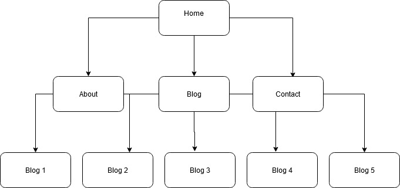

# Website Link

# Github Repo

https://github.com/mzharr/Portfolio.git

# Website Description

## Purpose

This website will showcase myself towards potential employers utilising HTML and CSS elements to output information in an interestign and responsive way

## Functionality/Features

HTML elements were used to make a functional navbar that leads the user to other pages in addition a responsive layout that will scale down to the appropriate media device ensuring a reliable experience for all users

## Sitemaps

A sitemap was utilised for visual assistance ensuring no duplicate pages were made

## Screenshots

## Target Audience

This portfolio targets potential employers possesing competencies relating to information technology and software developement in addition to veteran experience and strict professionalism

## Tech Stack

The stack associated with this project is HTML and CSS, Github was used to make a repository and netifly was used to deploy the website
